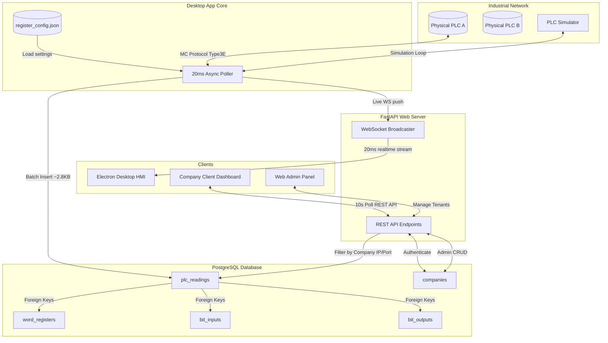

# PLC System Documentation

This document explains the architecture, runtime workflows, multi-tenant portal model, and data storage footprints for the centralized **PLC Tag Monitor** system.

---

## 1. System Architecture & Workflows

The system is split into three main components:
1. **FastAPI Backend (Python)**: Handles high-speed PLC polling, database logging, WebSocket live streams, and REST API queries.
2. **Desktop HMI Application (Electron)**: Spawns the local backend, displays the real-time HMI, and lets engineers configure targets and registers.
3. **Web Portal Dashboard (HTML5/CSS3/JS)**: A multi-tenant portal allowing administrators to manage company profiles and company clients to query their isolated PLC logs.

### Centralized Data Workflow Diagram
The diagram below outlines the 20ms high-speed polling cycle, database write pathways, and multi-tenant web client isolation:

---

## 2. Dynamic Register & Multi-Tenant Model

### Monitored Registers Configuration
Monitored registers are dynamically parsed by the poller from `register_config.json`. The system supports:
- **`int16` (1 word)**: Signed 16-bit integers.
- **`int32` (2 words)**: Signed 32-bit integers.
- **`float32` (2 words)**: IEEE 754 floating-point values.
- **`string` (custom span)**: Contiguous ASCII character registers.

The poller minimizes communications latency by performing a **single batch read** spanning from the lowest to the highest configured register index, then unpacking the raw 16-bit words locally into typed values.

### Multi-Tenant Company Portal
The database stores tenant profiles in the `companies` table, assigning each company a unique access password and a specific PLC target (IP & Port). 
- **Admin Users**: Manage company records (add, delete, view credentials).
- **Company Clients**: View their isolated readings. All endpoints filter query logs strictly on the company's assigned `plc_ip` and `plc_port`.

---

## 3. High-Frequency Storage Sizing Estimation

Polling at **20ms (50Hz)** generates large data volumes. The calculations below estimate the storage required for standard operations (assuming 18 digital inputs, 18 digital outputs, and 5 dynamic data registers).

### Row Sizing Analysis (PostgreSQL)

| Database Table | Column Types & Indexes | Row Size (Bytes) | Rows / Poll | Raw Size / Poll |
| :--- | :--- | :--- | :--- | :--- |
| **`plc_readings`** | `id` (INT), `timestamp` (TIMESTAMPTZ), `plc_ip` (VARCHAR), `plc_port` (INT), `status` (VARCHAR) + 1 index | ~100 B | 1 | 100 B |
| **`bit_inputs`** | `id` (INT), `plc_reading_id` (INT), `address` (VARCHAR), `value` (BOOL) + 1 index | ~40 B | 18 | 720 B |
| **`bit_outputs`** | `id` (INT), `plc_reading_id` (INT), `address` (VARCHAR), `value` (BOOL) + 1 index | ~40 B | 18 | 720 B |
| **`word_registers`**| `id` (INT), `plc_reading_id` (INT), `address` (VARCHAR), `value` (VARCHAR), `data_type` (VARCHAR), `value_int` (INT), `value_float` (DOUBLE), `value_str` (VARCHAR) + 1 index | ~80 B | 5 | 400 B |

* **Total Raw Data Size per Poll**: `100 + 720 + 720 + 400 = 1,940 Bytes (~1.9 KB)`
* **Index & DB Overhead (WAL, Page Alignment ~45%)**: **~2.8 KB per poll**

### Storage Volume Over Time (20ms / 50Hz)

* **1 Second** (50 Polls): `140 KB`
* **1 Minute** (3,000 Polls): `8.4 MB`
* **1 Hour** (180,000 Polls): `504 MB`
* **1 Day** (4,320,000 Polls): **`12.1 GB`**
* **1 Week** (30,240,000 Polls): **`84.7 GB`**
* **1 Month** (129,600,000 Polls): **`362.8 GB`**
* **1 Year** (1,576,800,000 Polls): **`4.41 TB`**

---

## 4. Industrial Optimization Recommendations

To mitigate massive database growth, industrial SCADA & historian systems implement these strategies:

1. **Decoupled Sampling and Archiving (Recommended)**:
   Poll at **20ms** for HMI animations and live WebSocket charts, but serialize logs to PostgreSQL at **1 second (1Hz)** or **5 seconds**. 
   * *Impact*: Reduces daily storage consumption from **12.1 GB/day** to **240 MB/day** (at 1s archiving).
2. **Deadbanding (Report-on-Change)**:
   Only write a row in the `word_registers` database table if the register value fluctuates past a deadband threshold (e.g. value changes by $>0.5\%$).
3. **Partitioning & Auto-Purging**:
   Partition database tables weekly. Set a cron task in the database to drop partitions older than a set retention window (e.g., 30 days).
